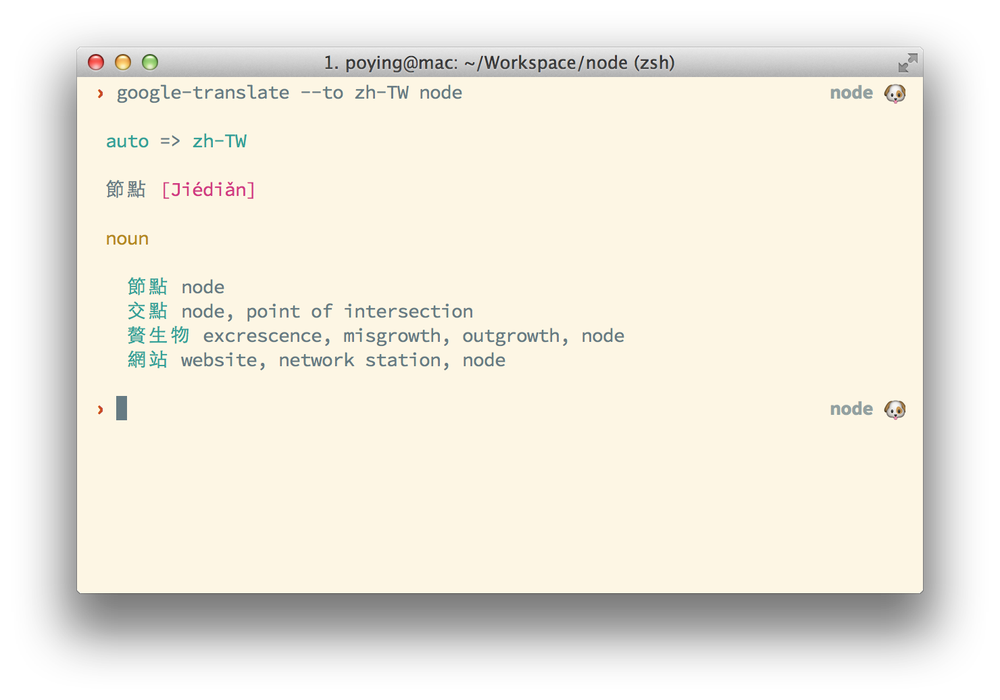

google-translate-tool
=====================



早上醒來沒事，寫個打發時間專案，順便向[大神](https://github.com/afc163/fanyi)致敬 XD

## Install

```bash
$ npm install -g google-translate-tool
```

## Usage

```bash
$ google-translate --from=en --to=zh-TW Hello World
```

### Output JSON format

```bash
$ google-translate --to=zh-TW --json --perty hello
```

## License

MIT.
